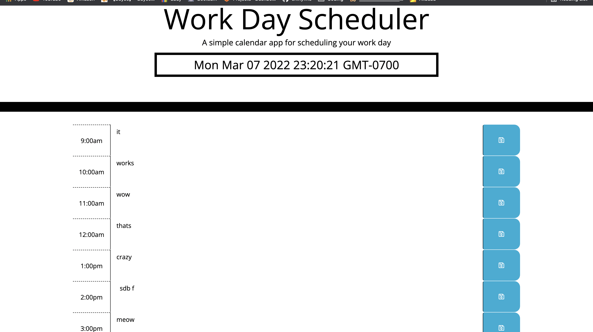

# Work Day Scheduler Starter Code
This program is meant to establish foundational skills needed to access and leverage api's to our WILL.
 
This program will allow the user to choose dates and notes to catalog in the columns. 
 
Ofcourse we will allow personalization so the user can edit and change for the busy schedule they have. 
 
All the info will be saved in the local storage. 

